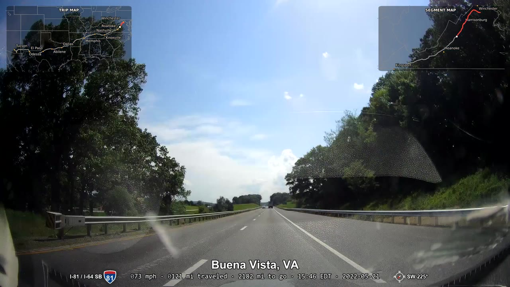
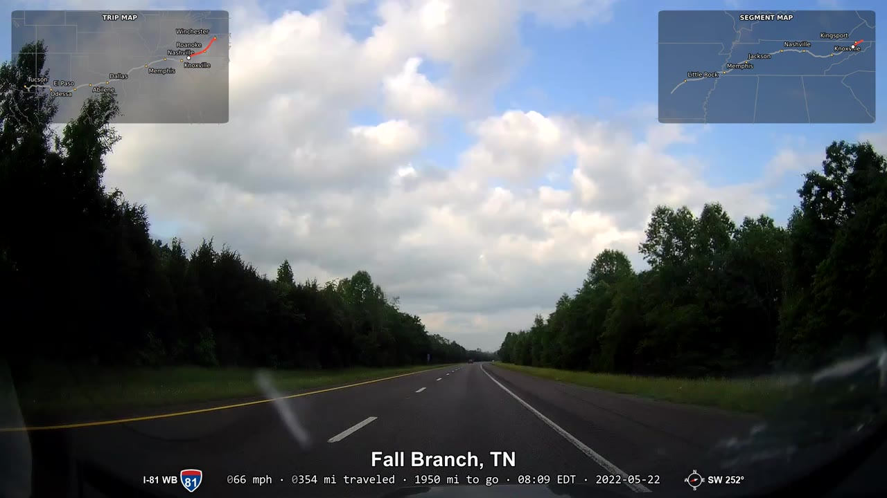
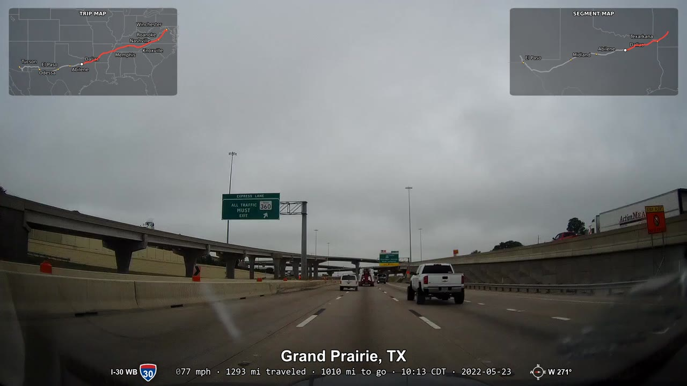
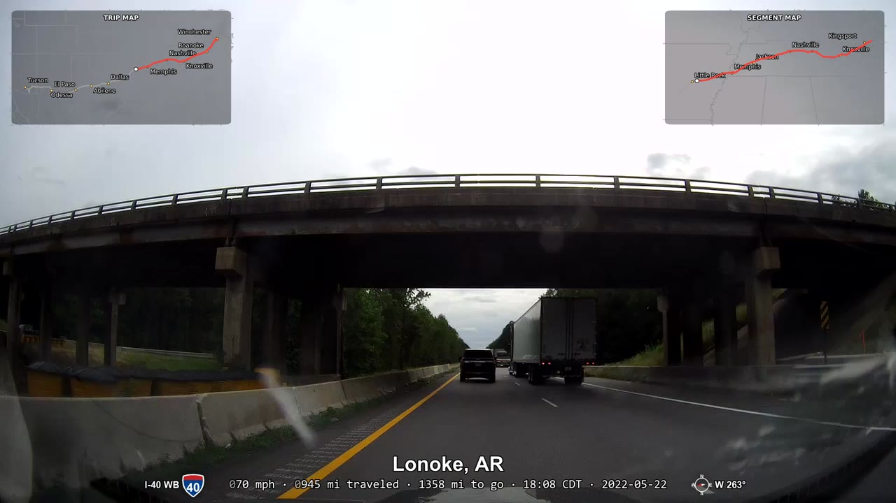

# RoadBurner

  

Turns raw dashcam footage into a single video with a burned-in GPS overlay:
town/state label, an odometer-style speed/distance/local-time info line, a
live route map inset, and (optionally) highway shields, local road names,
and a compass heading indicator as you drive.

Built around one real use case - a ~2000mi cross-country road trip - but
the pipeline itself is generic: point it at any folder of dashcam clips
that record Novatek-style `freeGPS` NMEA data and it will extract a full
route and render an overlay video.

## Example output

Frames from a real full-resolution render (VA -> AZ, ~2000mi), picked at
random points along the route:

<p>
  
  
</p>
<p>
  
  
</p>

## How it works

Two stages, run in order:

1. **`extract_gps.py`** - scans every `.MP4` in your clip folder, pulls the
   embedded GPS chunks, reverse-geocodes each point to a town/state
   (offline, via `reverse_geocoder`), and writes intermediate files to your
   work folder: `track.csv` (the full route), `labels.csv` (deduped
   town-label spans), `concat.txt` (ffmpeg concat list, in clip order),
   `gaps.csv` (spans with zero GPS signal - camera keeps recording, GPS
   just didn't lock), and `duration_sec`.
2. **`render_overlay.py`** - builds a subtitle track and map-inset frames
   from those intermediate files, then does a single ffmpeg pass to
   concatenate every clip and burn in the overlay.

Clips with no GPS signal at all (tunnels, parking garages, cold start
before satellite lock) are never dropped - the video keeps that footage
and shows a configurable "no GPS lock" indicator instead of guessing.

## Requirements

- Developed and tested against 1920x1080 dashcam footage. Overlay
  elements (maps, fonts, shields, info-strip) are currently sized in
  absolute pixels tuned for that resolution, not proportionally - higher-
  resolution (4K+) camera support is planned but not yet built (see
  CHANGELOG.md's Unreleased section).
- Python 3.10+
- [ffmpeg / ffprobe](https://ffmpeg.org/) on your `PATH`
- Python packages: `pip install -r requirements.txt`
  (`reverse_geocoder`, `matplotlib`, `Pillow`; `pyshp` is only needed for
  the optional `tools/fetch_tiger_roads.py` helper below)

## Setup

```
git clone https://github.com/sfaith/RoadBurner.git
cd RoadBurner
```

Then either run the interactive setup wizard - checks Python/ffmpeg,
installs dependencies, and creates `config.ini` for you:

```
.\setup.ps1      # Windows (PowerShell) - or double-click setup.bat
./setup.sh       # Linux / WSL / macOS
```

...or do it by hand:

```
pip install -r requirements.txt
copy config.example.ini config.ini      # PowerShell: Copy-Item; bash: cp
```

Either way, edit `config.ini` - never the `.py` scripts - to point
`clip_folder` at your dashcam footage and adjust label/info/map settings.
`config.ini` is gitignored so your personal paths and settings never get
committed.

## Selecting footage

`clip_folder` can point anywhere - a subfolder you create inside the
clone (e.g. `clips/2024-summer-trip`), an absolute path elsewhere on
disk, or a network share / mapped drive (`\\nas\dashcam\2024TripFootage`
or `Z:\Dashcam\2024TripFootage`). `extract_gps.py` scans that one folder
non-recursively for every `.MP4`/`.mp4` in it - there's no date-range or
include/exclude filtering, and it won't look into subfolders.

In other words: RoadBurner doesn't pick clips for you. If your card or
share has footage from more than one trip mixed together, organize the
clips you want into their own folder first, then point `clip_folder`
there. `setup.ps1`/`setup.sh` will count and report how many `.MP4`
files it finds at the path you give it, so a typo'd or empty folder
shows up immediately instead of failing later in `extract_gps.py`.

## Running

```
python extract_gps.py --config config.ini
python render_overlay.py --config config.ini
```

Set `preview_scale` under `[video]` (e.g. `960x540`) for fast low-res test
renders before committing to a full-resolution run. Set `threads` under
`[video]` to cap how many cores ffmpeg's encode step uses - leave it
blank for the fastest render (all cores), or set a number below your
CPU's core count if you'd rather a long render leave your machine usable
in the meantime.

## Road names (optional)

`[roads]` (highway shields) and `[local_roads]` (local street names, e.g.
"Maple Street WB") are both disabled by default. They need real Census
TIGER road data, which isn't shipped in this repo - the two `.geojson`
fixtures under `map_data/synthetic_*` are hand-built test data for the
unit tests only, not real roads, and are not suitable for a real render.

To use real road data, run `extract_gps.py` first (so `track.csv` exists),
then fetch and convert real [Census TIGER/Line](https://www.census.gov/geographies/mapping-files/time-series/geo/tiger-line-file.html)
data with the included helper:

```
python tools/fetch_tiger_roads.py --track work/track.csv
python tools/fetch_tiger_roads.py --track work/track.csv --skip-local   # highways only, fast
```

This downloads two products, both public-domain (no API key needed):
- **Highways** (`map_data/roads.geojson`): TIGER "Primary and Secondary
  Roads", one file per state - the states are derived from your own
  `track.csv`, not hardcoded, so this scales as your footage grows.
  Filtered to `RTTYP` `I`/`U` (Interstates and US routes).
- **Local streets** (`map_data/local_roads.geojson`): TIGER "All Roads",
  shipped per-county - counties are resolved by sampling points along
  your route and reverse-geocoding each to a county FIPS via the free
  FCC Census Block API, no local shapefile/spatial join needed.

Both are trimmed to a padded bounding box around your route, not the
whole state/county network. The output files are gitignored - they're
route-specific and meant to be regenerated locally, not committed.

Then set `enabled = true` under `[roads]` and/or `[local_roads]` in
`config.ini` (already pointed at `map_data/roads.geojson`/
`map_data/local_roads.geojson` by default).

Road matching is brute-force point-to-polyline, so the **first** render
against a given road file can be slow - tens of minutes for `[local_roads]`
against a full county-level street file on a multi-hour trip. After that
first pass, results are cached two ways: a whole-track cache skips
matching entirely on an unchanged clip set, and a point-level cache
(keyed on the GPS fixes themselves) means adding, removing, or reordering
a clip only re-matches the points that actually changed, not the whole
trip. Both caches live under your `work_folder`.

## Running tests

```
python -m unittest discover tests
```

Tests cover the pure logic (GPS parsing, road matching, span/gap
handling, label formatting) with synthetic fixtures - no real footage or
real road data required.

## Project layout

```
extract_gps.py       Stage 1: GPS extraction + reverse geocoding
render_overlay.py     Stage 2: overlay rendering
setup.ps1/.sh/.bat     Optional first-run setup wizard (see Setup above)
config.example.ini    Template - copy to config.ini and edit
tools/                 Optional helpers (fetch_tiger_roads.py)
tests/                 Unit tests (synthetic fixtures only)
map_data/              Borders/cities reference data + synthetic test fixtures
                        (real roads.geojson/local_roads.geojson are gitignored)
```

Your own footage, work folders, and rendered output (`real_cam/`, `work*/`,
`trip_samples/`, etc.) are gitignored - see `.gitignore`.

## License

MIT - see `LICENSE`.
